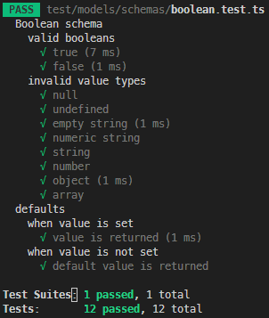
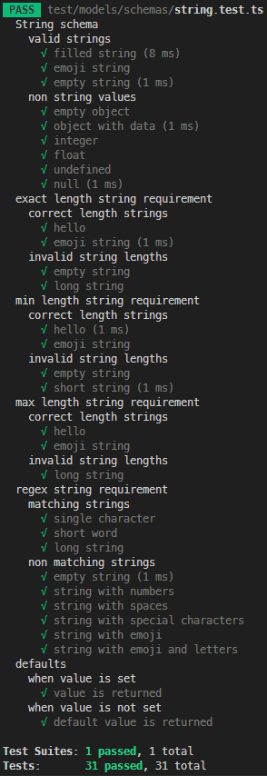
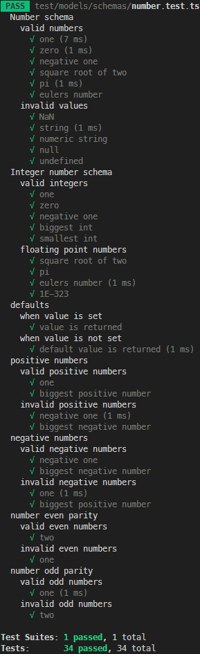

# Testrapport

## Vad testas?

Testen är uppdelade i tre delar (filer), en del för varje schema. Varje del innehåller flera tester som testar varje typ av krav som finns i respektive schemat, minst ett positivt och ett negativt test för varje krav.

### Exempel

För att testa `f.String().length()` så testas följande positiva tester:

- `HelloWorld`
- `😋📙😋📙📙`

Och dessa negativa tester:

- _En tom sträng_
- `HelloWorldHelloWorld`

Utöver att kräva ett misslyckad validering så krävs även att rätt felkod returneras.

## Hur testas det?

Testerna körs med ett testramverk som heter [Jest](https://jestjs.io/) tillsammans med [TS-Jest](https://www.npmjs.com/package/ts-jest) för att få det att fungera med TypeScript.

För att köra testerna kör man `npm run test` i terminalen i projektets rotmapp.

## Testresultat

### Boolean

### String

### Number

